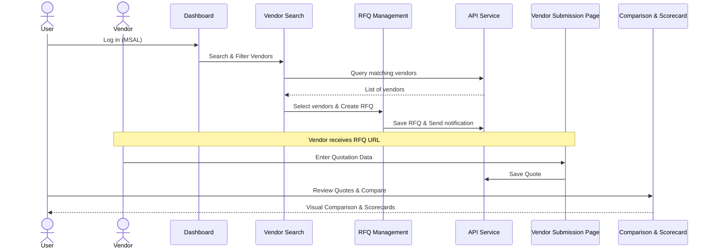

Organizations, especially MSMEs, struggle with inefficient vendor procurement processes driven by manual work. Vendor shortlisting relies on static Excel sheets and scattered data sources, making it difficult to identify reliable suppliers quickly.

RFQ responses often arrive in unstructured formats such as emails, PDFs, and spreadsheets, forcing procurement teams to manually extract pricing, delivery timelines, and contractual details. This results in repetitive effort, comparison errors, delayed decision-making, and missed cost-saving opportunities.

Overall, sourcing decisions take weeks and require significant manual intervention, reducing operational efficiency.

## Installation
git clone "https://github.com/Pradeep960/Vendorverse"
cd project
npm install
npm run dev

##Entry Point 
App.tsx

## Features
- Vendor Search using AI
- RFQ Generator
- Email Notification Service
- Quotation Upload
- AI Comparison Engine

## Tech Stack
##Backend
- Python 
- Serp API
- LLM
##Front End
- React & TypeScript 
- Graph API

## Application Flow
1.  **Authentication**: Users log in via Microsoft Authentication Library (MSAL).
2.  **Dashboard**: Landing page with a summary of activities and metrics.
3.  **Vendor Discovery**:
    *   **Search**: Filter vendors by part name, certifications (ISO, etc.), location, and budget.
    *   **Selection**: Choose one or more vendors to initiate a Request for Quotation (RFQ).
4.  **RFQ Management**:
    *   **Generation**: Create a new RFQ with specific requirements and attach supporting documents (e.g., drawings).
    *   **Tracking**: View the status of all RFQs (Pending, Received, Completed).
5.  **Vendor Response**:
    *   **Submission**: Vendors access a unique submission link provided by the system.
    *   **Quotation Entry**: Vendors input their pricing, lead times, and terms.
6.  **Analysis & Decision**:
    *   **Quotes Analysis**: Review and compare vendor responses side-by-side.
    *   **Vendor Comparison**: Detailed evaluation using a comparison engine.
    *   **Scorecards**: Assess vendor performance based on historical data and current quotes.

### Sequence Diagram

## Core Modules
-   **`src/pages/VendorSearch`**: Advanced filtering and vendor discovery interface.
-   **`src/pages/RFQ`**: Management of Requests for Quotation and their lifecycle.
-   **`src/pages/VendorSubmit`**: Public-facing page for vendors to submit their pricing and terms.
-   **`src/pages/Comparison` & `src/pages/Scorecard`**: Decision-support tools for evaluating vendor proposals.
-   **`src/services/apiService.ts`**: Centralized API client using Axios, integrated with `storageService` for local data persistence.

